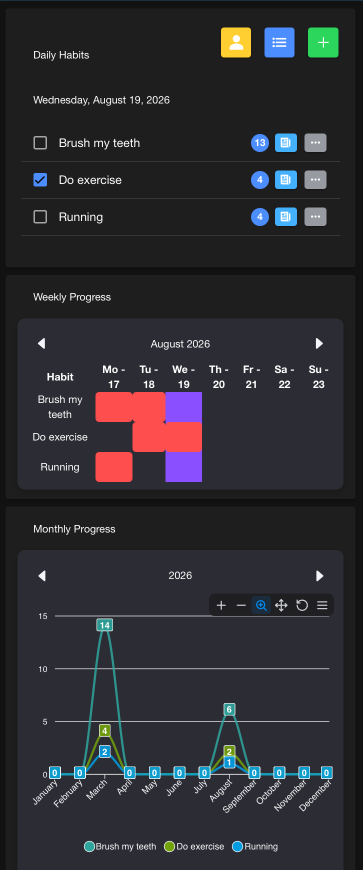
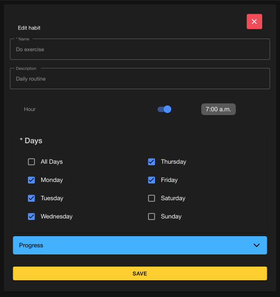
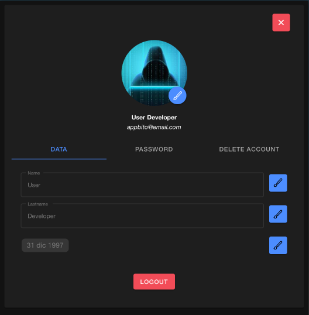

# Appbito Frontend Client - Version 2


The official frontend client for the Appbito platform. Built primarily as an interface to consume and showcase the capabilities of the [Appbito Spring Boot API](https://github.com/JozRamirez10/Appbito-Backend), this project delivers a hybrid mobile experience. It leverages modern Angular paradigms to ensure a highly reactive, scalable, and secure user experience.

## 🏗️ Architecture & Tech Stack

*   **Framework:** Angular 19 (Standalone Components)
*   **UI Library:** Ionic Framework 8
*   **Styling:** Tailwind CSS & SCSS
*   **Mobile Runtime:** Capacitor (Android / iOS support)
*   **Data Visualization:** ApexCharts

### ⚡ Engineering Highlights
*   **Reactive State Management:** Fully migrated to **Angular Signals** for state handling (`HabitState`, `UserState`). This architecture provides surgical DOM updates, eliminates complex RxJS boilerplate, and prevents race conditions during asynchronous data fetching.
*   **Hybrid Secure Storage:** A multi-layered JWT management system that combines in-memory RAM caching (for instant HTTP Interceptor access) with native Capacitor Preferences (for persistent local storage), ensuring seamless and secure mobile sessions.
*   **Smart Network Routing:** Environment configurations automatically detect the runtime platform (Web vs. Native Android Emulator) to route API calls accurately without manual intervention.

> **Note on Testing & Scope:** As the core business logic, E2E workflows, and security layers are heavily enforced on the Spring Boot Backend (featuring 100% JaCoCo coverage and static analysis), this frontend repository currently prioritizes rapid UI/UX iteration, state management design, and API integration over frontend-specific unit testing.

---

## 📱 User Interface (Current Version)

> **🚧 UI Refactoring in Progress:** The interface shown below represents the current functional version. The UI is currently undergoing a complete redesign using **Tailwind CSS** to enhance the mobile layout, typography, and overall UX. These screenshots will be updated once the new design system is merged.

| Daily Habits | Habit Details | User Profile |
| :---: | :---: | :---: |
|  |  |  |

---

## 📂 Repository Structure

```text
appbito-frontend/
├── android/                  # Native Android project (Generated by Capacitor)
├── resources/                # App icons and splash screens
├── src/
│   ├── app/
│   │   ├── classes/          # Base classes for component inheritance
│   │   ├── components/       # Standalone UI components (Daily Habits, Forms, etc.)
│   │   ├── constants/        # Centralized API routes, magic strings, and settings
│   │   ├── enums/            # TypeScript enumerations (e.g., Modal Actions)
│   │   ├── guards/           # Angular Route Guards (Auth protection)
│   │   ├── interceptors/     # HTTP Interceptors (JWT injection, Error handling)
│   │   ├── models/           # DTOs and internal state interfaces
│   │   ├── services/         # Pure HTTP DAOs, Modals, and Auth Services
│   │   ├── states/           # Signal-based reactive state managers
│   │   └── utils/            # Helper functions and UI utilities
│   ├── assets/               # Static assets (images, global icons)
│   ├── environments/         # Environment configurations (Dev/Prod)
│   └── theme/                # Global Ionic variables and styling
├── tailwind.config.js        # Utility-first styling configuration
├── capacitor.config.ts       # Native bridge configuration
└── README.md
```

---

## 🚀 Getting Started

### Prerequisites
*   Node.js (v20+)
*   Angular CLI (`npm install -g @angular/cli`)
*   Ionic CLI (`npm install -g @ionic/cli`)
*   *Required:* The [Appbito Backend API](https://github.com/JozRamirez10/Appbito-Backend) must be running locally or remotely.

### Environment Setup

The application uses smart environment routing to detect whether you are running it in a web browser or inside a native mobile emulator.

**Development Environment (`src/environments/environment.ts`):**
By default, the app uses `Capacitor.isNativePlatform()` to route API requests.
*   If running in a web browser, it targets `http://localhost:8080`.
*   If running on an Android Emulator, it targets `[http://10.0.2.2:8080](http://10.0.2.2:8080)` (the Android alias for the host machine's localhost).

**Production Environment (`src/environments/environment.prod.ts`):**
Before building for production, update this file with your deployed Spring Boot API URL:
```typescript
export const environment = {
    production: true,
    apiUrl: 'https://api.yourdomain.com'
}
```

### Installation & Execution

**1. Clone and Install:**
```bash
git clone https://github.com/JozRamirez10/Appbito-Frontend.git
cd Appbito-Frontend
npm install
```

**2. Run the Development Server (Web):**
```bash
ionic serve
```

**3. Run on Native Android (Capacitor):**
```bash
# Compile the Angular web assets
ionic build

# Sync assets to the native Android project
npx cap sync android

# Open Android Studio to build the APK / run the emulator
npx cap open android
```

---

## 📄 License

This project is licensed under the MIT License. See the [LICENSE](LICENSE) file for details.

---

## 🤝 Contributing
1. Create your Feature Branch (`git checkout -b feature/AmazingFeature`)
2. Commit your Changes (`git commit -m 'Add some AmazingFeature'`)
3. Push to the Branch (`git push origin feature/AmazingFeature`)
4. Open a Pull Request.
